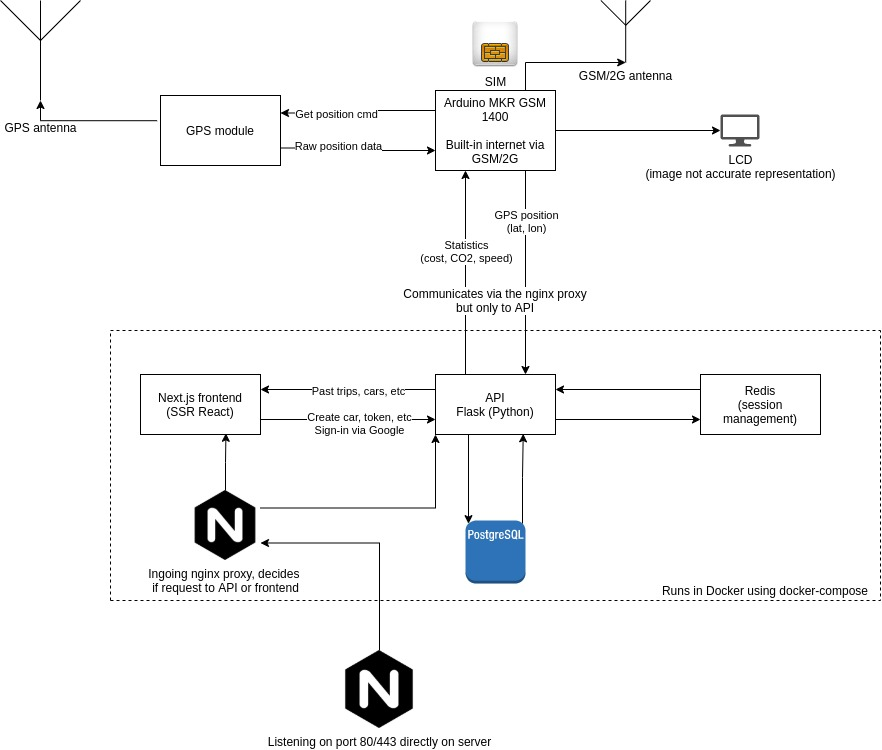
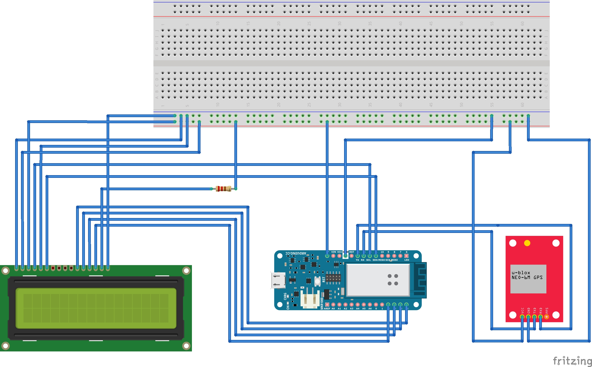
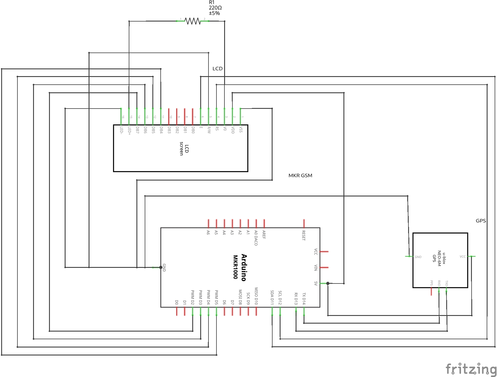

# miljomataren


| Build     | Type                                                                             | Build Status                                                                                                                                         |
| --------- | -------------------------------------------------------------------------------- | ---------------------------------------------------------------------------------------------------------------------------------------------------- |
| Travis CI | Code Style                                                                       | [](https://travis-ci.com/github/vilhelmprytz/miljomataren)                  |
| GitLab CI | [Container Registry](https://gitlab.com/vilhelm/miljomataren/container_registry) | [](https://gitlab.com/vilhelm/miljomataren/-/pipelines) |

Diploma project "miljömätaren". Fullstack web application deployable using Docker.

## Introduction

This project aims to assemble a meter that sits in the air conditioning vents of a car’s instrument panel and shows real-time driving costs, fuel consumption, and carbon emissions using a display.

The project consists of three main components. The first component of this project is the physical gauge installed in the car’s instrument panel. The housing for the gauge is 3D-printed and designed using CAD software (Fusion 360). It contains an LCD connected to a microcontroller board called Arduino MKR GSM 1400. The Arduino board has cellular connectivity (GSM/2G), meaning it can fetch and send data to servers on the internet. To the Arduino, a GPS module with an associated antenna was attached. The Arduino was then able to locate the current position of the automobile and send it to a server using cellular connectivity. The display was used to show the real-time cost and carbon emissions of the current trip, as calculated by the server.

The second component of the project is the web application API (Application Programming Interface). The API was written in a programming language called Python together with a library called Flask. The API was configured to run on a server in the cloud. The Arduino microcontroller was configured to communicate with this API. The API was responsible for user authentication, receiving GPS positioning and calculating carbon emissions and real-time cost of current and past trips. The API uses [Google Sign-In](https://developers.google.com/identity/sign-in/web/sign-in) for authentication.

The third component of this project is the web application frontend. The frontend is a separate application, written separately from the API. The front end was coded to use the API to show statistics to the end-user on a web page. The frontend was coded in JavaScript using a framework called React.

## Structure

| Codebase               |   Description    |
| :--------------------- | :--------------: |
| [abernathy](abernathy) | Next.js frontend |
| [lowe](lowe)           |  Flask backend   |
| [delos](delos)         |   Arduino code   |

## Equipment

- Arduino MKR GSM 1400
- LCD module compatible with Hitachi HD44780 driver. [Datasheet](https://www.electrokit.com/uploads/productfile/41014/JHD202C.pdf) for the one used in this project.
- GPS module such as [GPS breakout board FGPMMOPA6H](https://servicepunkten.com/downloads/FGPMMOPA6H_BOB.pdf)

## System Overview



## Circuit Diagram/Schematic

Circuit Diagram/Schematic for physical device.



Note! The GPS module and LCD showed above may not be identical to the modules used in the project. You may have to adjust settings in the code and/or the wiring to fit your specific GPS module and LCD. The Arduino is labelled as "MKR 1000" but we used the MKR GSM 1400 for the actual device.



## Deploying application

To deploy the application, [Docker](https://docs.docker.com/engine/install/ubuntu/) and [docker-compose](https://docs.docker.com/compose/install/) are both required.

Firstly, you need to configure the application. You can use the `.env.example` as reference, simply copy it to `.env` and modify it to suit your setup.

```bash
cp .env.example .env
vim .env
```

You also need to create a file named `fuel_prices.json` with the current fuel prices (in unit kr/l).

```json
{
  "petrol": 16.14,
  "diesel": 16.27
}
```

Once it's configured, use docker-compose to start the application.

```bash
docker-compose -f prod.yml up -d
```

## Project limitations

### Lack of automated vehicle information

Ideally, the user should only have to enter the registration number of their vehicle and fuel consumption, CO2 emissions and yearly milage of the vehicle should automatically be fetched from [Transportstyrelsen](https://transportstyrelsen.se) (or any other public database). The problem with this is that most APIs are not open to the public and using them induces quite a large cost. We cannot simply afford to do this under the limitations of the project which is why the user has to manually input details about their vehicle. If this application would be commercialized, this would definitely be implementable.

### Fuel consumption on the paper is not real world fuel consumption

This project only uses GPS positioning as well as vehicle information to determine the realtime cost, fuel consumption and CO2 emissions. For a short drive, this isn't an accurate representation of real-world usage. Cars are considerably less fuel-efficient when the engine is cold, thus short trips, where the engine doesn't have time to warm up, will be very inefficient. Our model doesn't reflect that.

Secondly, people drive differently. Aggressive driving and bad planning also leads to less fuel efficiency and is not reflected in this project.

## License

Licensed under the terms of the GNU GPL-3.0 License. See the [license](LICENSE) file.

## Project Authors ✨

- [Vilhelm Prytz](https://github.com/vilhelmprytz), vilhelm@prytznet.se
- [Felix Lindblad](https://github.com/felixlindblad)
- [Ludwig Sjöberg](https://github.com/ludwigsjo)

This codebase is written by Vilhelm Prytz.
